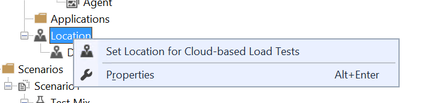
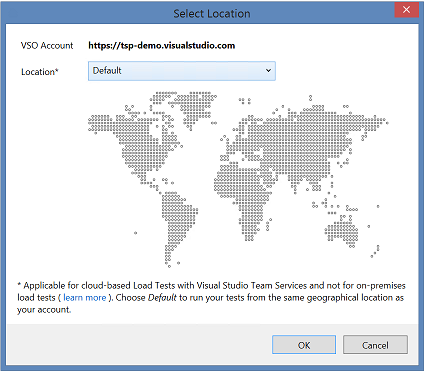
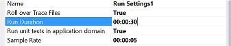
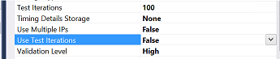
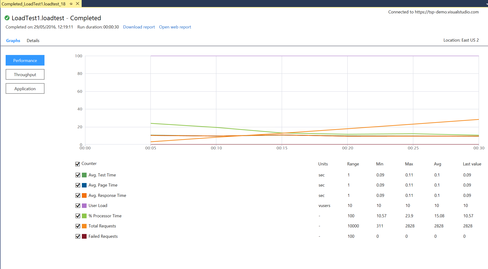
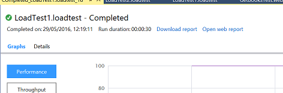

# Exercise 4 - Load Test

## Learnings

1. Running a load test in the cloud

## Change Load Test to run in the cloud

1. **Discussion points:**
   * General overview over Visual Studio load testing capabilities in the cloud 
    * Visual Studio load tests
    * JMeter test (preview)
    * URL based tests (preview)
    * archive based tests (preview)
   * Load Tests in the cloud are billed per usage. Free minutes are provided

1. Use the load test you have previously created in exercise 3.

1. Make sure you are connected to VSTS in team explorer

1. Open the load test (double click in solution explorer) and right click on location and select "Set Location for Cloud-based Load Tests"
   
   
1. Select the location where the load test will be used (default is fine) 

1. Change the following properties of the test run (this is needed because cloud tests currently don't support fixed iterations) (see [Get started with performance testing](https://www.visualstudio.com/en-us/docs/test/performance-testing/getting-started/getting-started-with-performance-testing) for more info)
    * Set Run Duration to 00:00:30     
   
    * Set Use Test Iteration to false   
   

1. Run load test. 
   

1. Analyze load test results. 
   
   
1. Click on `Open Web Report` 
    
   See the results on the browser, explore them a little to get familiarized with the browser based reports.
   
> Note: All your load tests executed on the cloud are available in your VSTS account (Load Test hub). 
They can be analyzed using a browser and you can even compare two load reports.
The load loads can also be re executed within the browser. No need to run them on Visua Studio
